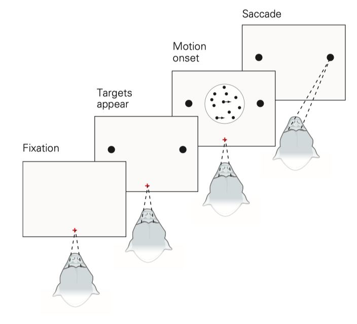
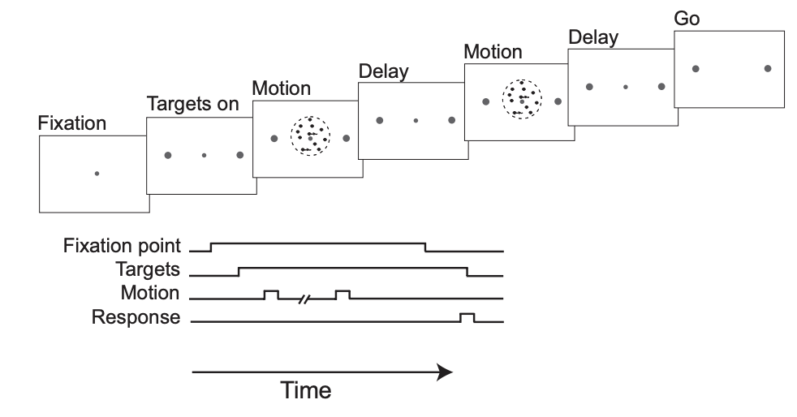
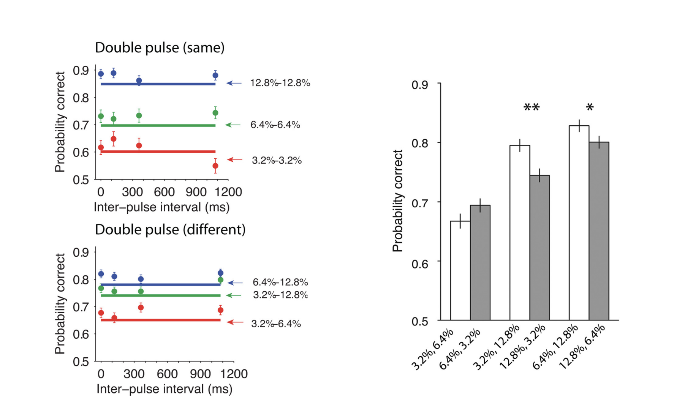
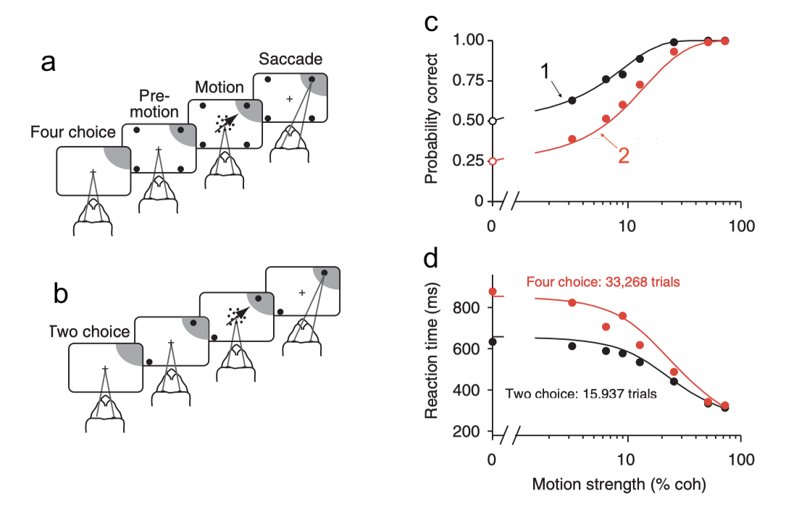
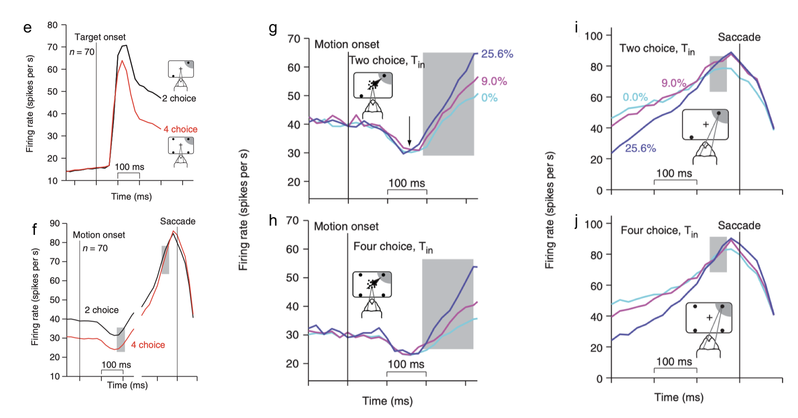
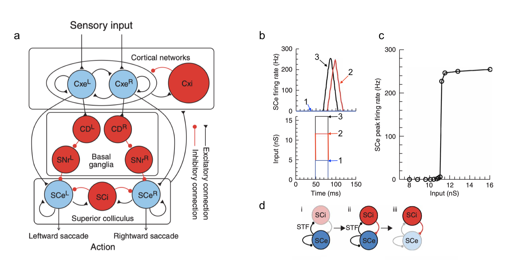
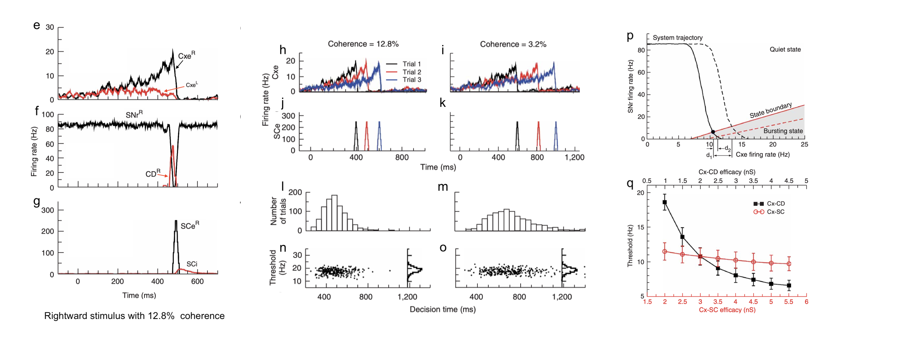

# IrBO26DM Final Exam

## Q1

The following are three points on a ROC curve in a two-alternative forced-choice task.

- $\mathbb{P}(r\geq z_1|-) = 0, \; \mathbb{P}(r\geq z_1|+) = 0$
- $\mathbb{P}(r\geq z_2|-) = 0.2, \; \mathbb{P}(r\geq z_2|+) = 0.7$
- $\mathbb{P}(r\geq z_3|-) = 1, \; \mathbb{P}(r\geq z_3|+) = 1$

What is the predicted percentage of correct responses?

## Q2

The speed and accuracy of a decision are explained by a process of evidence accumulation.

\

1. Thresholds closer to the origin lead to higher-speed lower-accuracy decisions.
2. Purely noisy inputs (0% coherence) lead to 0% correct choices.
3. Purely noisy inputs leads to no decision being made.
4. Purely coherent inputs (100% coherence) lead to instantaneous choices.
5. If the loss associated with an incorrect RIGHT choice is greater than an incorrect LEFT choice, the optimal strategy would set the RIGHT threshold closer to the origin than the LEFT threshold.

## Q3

Many decisions involve integration of evidence conferred by discrete cues over time. A study by Kiani et al. (2013) investigated whether human subjects are sensitive to temporal gaps between such cues. Subjects were asked to identify the direction of motion in a dynamic random dot display presented in two 120ms epochs. The strength of motion was randomized between the motion pulses, but the direction of motion (left or right) was the same. The interval between pulses ranged from 0 to 1.08s.

1. Choice accuracy was independent of motion strength.
2. Choice accuracy was independent of the interpulse interval.
3. Choice accuracy depended on the sequence of motion pulses.
4. Choices are made exclusively based on the second stimulus.
5. The weak–strong stimulus sequence resulted in lower accuracy than the strong–weak sequence.

## Q4

While decreasing the coherence in an RDM task is the more convenient way to increase task difficulty, it can also be increased by making the directions of motion more similar or increasing the subject's options. Churchland et al. (2008) measured behavioral and neurophysiological responses from the lateral intraparietal (LIP) area of monkeys on a two- and four-choice direction-discrimination decision task.

1. In figure c, (1) is associated with the two-choice and (2) with the four-choice task.
2. Reaction times were independent of the number of choices.
3. Evidence accumulation begins at a lower firing rate for the four-choice task.
4. Evidence accumulation reaches a higher level by the end of the decision process in the four-choice task.
5. In the presence of more options, subjects require more evidence before making a decision.

## Q5

Lo & Wang (2006) used a network model of spiking neurons to understand the neural substrate of decision thresholds.

1. SCe neuron activity is a linear function of input amplitude.
2. SCe burst is triggered when the firing rate of one of the Cxe populations reaches a threshold.
3. Threshold level is modulated by stimulus strength and decision time.
4. In figure p, d1 shows synaptic modification of the Cx-SC pathway while d2 shows synaptic modification of the Cx-CD pathway.
5. If we alter the degree of task difficulty by using different probability distributions of coherence levels, the optimal Cx-CD synaptic efficacy shifts toward a smaller value in the easy task and toward a larger value in the hard task.
